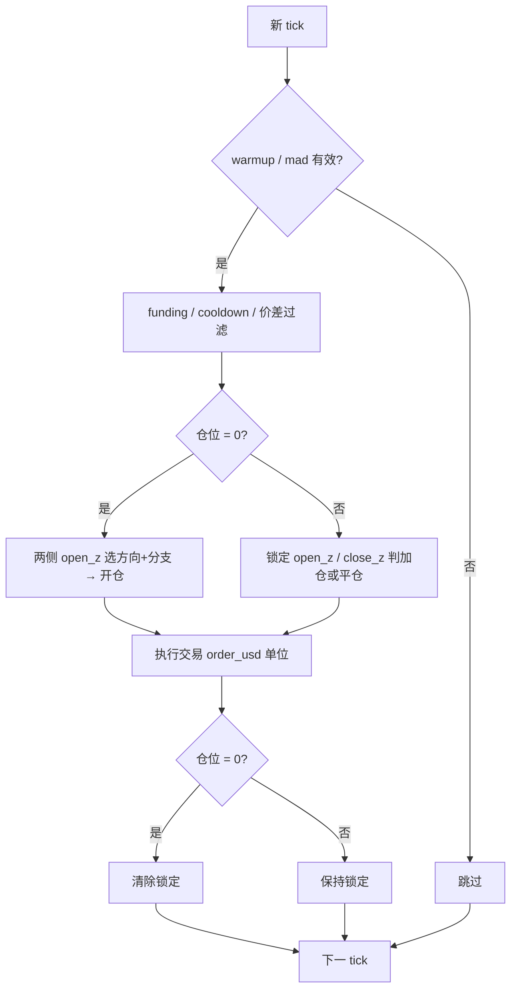

# CEX-CEX 回测信号逻辑（单独说明）

本文档总结 `backtest_cex_cex_open_only.py` 的信号与交易逻辑（含模拟期间开平仓）。

---

## 1. 基础定义

- 交易所映射：`A = Binance`，`B = Gate`
- 两个方向：
  - `-a+b`：对应 `spread_ab` => `(a_bid - b_ask) / b_ask * 100`
  - `+a-b`：对应 `spread_ba` => `(b_bid - a_ask) / a_ask * 100`
- 分腿仓位（数量）：
  - `-a+b`：`A_qty -= qty`，`B_qty += qty`
  - `+a-b`：`A_qty += qty`，`B_qty -= qty`

---

## 2. 成本处理后的价差

先把成本扣到价差里（用于 z-score 计算与硬过滤）：

- `spread_ab_adj = spread_ab - total_cost_pct`
- `spread_ba_adj = spread_ba - total_cost_pct`

其中：

- `total_cost_pct = (fee_bps_total + slippage_bps_total) / 100`
- 默认手续费双边万 4、滑点双边万 4，总计万 8（0.08%）

> spread 单位是「百分比点」，因此直接减 `0.08`。

---

## 3. 滚动统计（每个窗口分别算）

固定窗口列表：`10m, 30m, 1h, 3h, 6h, 12h`

对每个窗口：

- `median_ab`：`spread_ab`（**原始**价差，不扣成本）的滚动中位数
- `median_ba`：`spread_ba`（**原始**价差，不扣成本）的滚动中位数
- `mad_ab`：`median(|spread_ab - median_ab|)`
- `mad_ba`：`median(|spread_ba - median_ba|)`

异常处理：

- `mad_ab / mad_ba` 为 0 或空时，z 分数为 `NaN`
- 该 tick 跳过，不参与交易判断

Warmup：前 `window_min` 分钟只积累统计，不交易。

---

## 4. 分支 z-score 公式

z-score 里的 **spread 一律用扣费后的 `spread_*_adj`**；median / mad 来自原始 spread。

每个方向按 median 符号选 **分支 A 或 B**，得到一对 **open_z（开仓）** 与 **close_z（平仓）**。

### 4.1 `-a+b` 方向

分支条件：`median_ab < 0 && median_ba > 0` → 分支 A，否则分支 B。

| 分支 | open_z | close_z |
|------|--------|---------|
| A | `(spread_ab_adj + median_ba) / mad_ba` | `(spread_ba_adj - median_ba) / mad_ba` |
| B | `(spread_ab_adj - \|median_ba\|) / mad_ba` | `(spread_ba_adj - median_ba) / mad_ba` |

### 4.2 `+a-b` 方向

分支条件：`median_ba < 0 && median_ab > 0` → 分支 A，否则分支 B。

| 分支 | open_z | close_z |
|------|--------|---------|
| A | `(spread_ba_adj + median_ab) / mad_ab` | `(spread_ab_adj - median_ab) / mad_ab` |
| B | `(spread_ba_adj - \|median_ab\|) / mad_ab` | `(spread_ab_adj - median_ab) / mad_ab` |

---

## 5. 方向与公式锁定（状态机）

维护两个状态：

- `locked_direction`：`-a+b` 或 `+a-b`
- `locked_branch`：`A` 或 `B`

| 仓位 | 行为 |
|------|------|
| `A_qty = 0` 且 `B_qty = 0` | 每 tick 重新评估两侧 open_z，选方向 + 分支 |
| 有仓位 | 不换方向、不换分支，一直用锁定的 open_z / close_z 公式 |

**锁定**：从空仓首次开仓成功后，记录当时的 `direction + branch`。

**解锁**：仓位回到 `0, 0`（正常平完或强吃）后清除；下一笔信号重新选一组。

> 锁定的是 **分支结构（A/B）**；每 tick 的 spread、median、mad 数值仍随行情更新，代入同一组公式计算 z。

---

## 6. 每个 tick 的决策

### 6.1 空仓：选方向 + 开仓

1. 分别计算 `-a+b`、`+a-b` 的 open_z（各自按 median 选分支）
2. 与统一开仓阈值比较（默认扫描 `0, 1, 2, 3, 4`）：
   - `-a+b`：`open_z >= z_open`
   - `+a-b`：`open_z >= z_open`
3. 都不满足 → 跳过
4. 都满足 → 选 **open_z 更大** 的方向
5. 只一侧满足 → 选该侧
6. 执行 **开仓**（见第 8 节）

### 6.2 有仓：加仓 or 平仓

用锁定的 `direction + branch` 计算 open_z、close_z（公式仍按第 4 节分支）：

| 动作 | 条件 |
|------|------|
| 加仓 | `open_z >= z_open` |
| 平仓 | `close_z >= z_close` |

- 都不满足 → 跳过
- **同时满足** → 取 **z 更大** 的动作（加仓 or 平仓）
- 只一侧满足 → 执行该动作

### 6.3 阈值比较方式

- 所有方向的 **开仓 / 加仓** 共用 **`z_open`**，比较方式为 `open_z >= z_open`
- 所有方向的 **平仓** 共用 **`z_close`**，比较方式为 `close_z >= z_close`
- 脚本参数：`--z_open_list`、`--z_close_list`（默认均为 `0,1,2,3,4`）

---

## 7. 信号前置过滤

即便 z 满足，以下情况也会拦截（**开仓与平仓均适用**）：

- funding 为空（任一边 `NaN`）
- funding 小于阈值（默认 `< -0.1`）
- 1 秒频率限制（`cooldown_ms = 1000`）
- 价差硬过滤：该笔交易方向的 `adj_spread` 必须在 `[0, 10]` 区间
  - 开仓 / 加仓：按当前 `direction` 的 `adj_spread` 判断
  - 平仓：按反向交易方向（`-a+b` 平仓视为 `+a-b` 方向）的 `adj_spread` 判断

开仓 / 加仓额外限制（平仓 qty 不超过当前持仓，不受 max_position 加仓截断中的「无仓可开」分支约束）：

- 每次 `qty = order_usd / A 腿价格`（默认 `order_usd = 100`）
- 最大持仓 `max_position_usd` 换算为 `max_position_qty`
- 若超限，将本次 `qty` 截断到可用剩余仓位；截断后接近 0 则跳过

---

## 8. 下单与仓位（Netting）

### 8.1 数量换算

- `-a+b` 开仓/加仓：`qty = order_usd / a_bid`
- `+a-b` 开仓/加仓：`qty = order_usd / a_ask`
- **平仓**：同样按 `order_usd` 换算，但 `qty = min(order_usd / a_px, held_qty)`，每次最多减一个 U 本位单位

### 8.2 成交价格

**开仓 / 加仓**

- `-a+b`：A 用 `bid` 卖，B 用 `ask` 买
- `+a-b`：A 用 `ask` 买，B 用 `bid` 卖

**平仓**（执行反向方向交易）

- 平 `-a+b` 仓：A 用 `ask` 回补，B 用 `bid` 平多
- 平 `+a-b` 仓：A 用 `bid` 平多，B 用 `ask` 回补

### 8.3 Netting 与强吃

- **同向**（与 `locked_direction` 一致）→ 仓位增加
- **反向**（平仓）→ 仓位减少，等价于 netting 抵消已有 lot
- 单次平仓 qty 已 cap 在 `held_qty`，正常不会减出反向残留
- 若反向减仓导致 **越过 0 出现反向仓**（防御逻辑）→ **强吃到 `0, 0`**，清除锁定与 lot 簿，多余部分不保留

---

## 9. 参数扫描维度

默认阈值均为 **`0, 1, 2, 3, 4`**，不做约束裁剪，按**笛卡尔积**全量扫描。

### 9.1 `backtest_cex_cex_open_only.py`（开仓统一阈值）

每个币种对以下组合逐一回测：

- `window_min_list`（6 个固定窗口：`10, 30, 60, 180, 360, 720`）
- `z_open_list`（默认 `0,1,2,3,4`）
- `z_close_list`（默认 `0,1,2,3,4`）

组合数 = `6 × 5 × 5 = 150`（每个 symbol 一条 summary 行 × 150）。

### 9.2 `backtest_cex_cex_open_only_3param.py`（开仓分方向阈值）

每个币种对以下组合逐一回测：

- `window_min_list`（同上 6 个窗口）
- `z_open_ab_list`（默认 `0,1,2,3,4`）
- `z_open_ba_list`（默认 `0,1,2,3,4`）
- `z_close_list`（默认 `0,1,2,3,4`）

组合数 = `6 × 5 × 5 × 5 = 750`（每个 symbol × 750）。

> 不传命令行参数时，即按上述默认列表做完整笛卡尔积；需要缩小范围时再手动改 `--z_open_list` / `--z_close_list` 等。

---

## 10. PnL 计算

### 10.1 开仓 PnL（逐单累加）

- `-a+b`：`gross = qty * a_bid - qty * b_ask`
- `+a-b`：`gross = qty * b_bid - qty * a_ask`
- 手续费：双边各万 4，合计万 8
- 累计 → `open_profit_usd_total`

### 10.2 模拟期间平仓 PnL

每笔平仓按反向成交价计算 `gross_close - close_fee`，累计 → `close_profit_in_sim`。

### 10.3 回测末尾强平 / 回滚（3 口径）

若结束时仍有未平仓位：

- `close_qty = min(abs(a_pos_qty), abs(b_pos_qty))`

1. **last_tick**：最后一条 tick 反向平仓 → `close_profit_last_tick`
2. **rollback_unopened_fifo**：FIFO lot 回滚未对冲开仓收益
3. **rollback_unopened_lifo**：LIFO lot 回滚未对冲开仓收益

### 10.4 最终总收益

- `close_profit_usd_total = close_profit_in_sim + close_profit_last_tick`
- `profit_usd_total = open_profit_usd_total + close_profit_usd_total`（默认 last_tick 口径）
- rollback 口径总收益另含 `close_profit_in_sim`：
  - `profit_usd_total_rollback_unopened_fifo = open + close_profit_in_sim + rollback_fifo`
  - `profit_usd_total_rollback_unopened_lifo = open + close_profit_in_sim + rollback_lifo`

---

## 11. 主要输出字段

| 字段 | 含义 |
|------|------|
| `orders` | 总成交次数（`open_orders + close_orders`） |
| `open_orders` | 开仓 / 加仓次数（含 `-a+b` 与 `+a-b`） |
| `close_orders` | 模拟期间平仓次数 |
| `forced_flat_count` | 强吃到 0 的次数 |
| `open_profit_usd_total` | 开仓累计 PnL |
| `close_profit_in_sim` | 模拟期间平仓 PnL |
| `close_profit_usd_total` | 全部平仓 PnL（含末尾强平） |
| `profit_usd_total` | 总 PnL |
| `z_open` / `z_close` | 当前组合使用的开 / 平仓阈值 |
| `blocked_by_*` | 各类拦截计数 |

---

## 12. 流程概览

